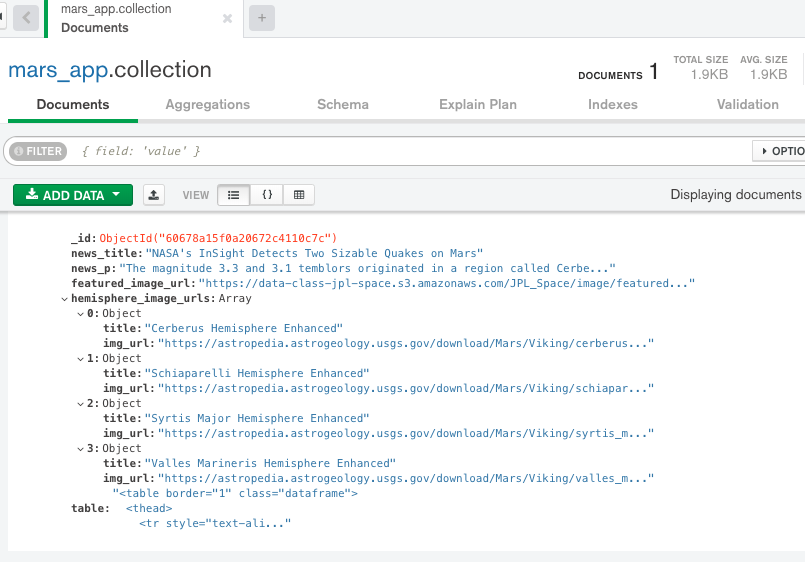
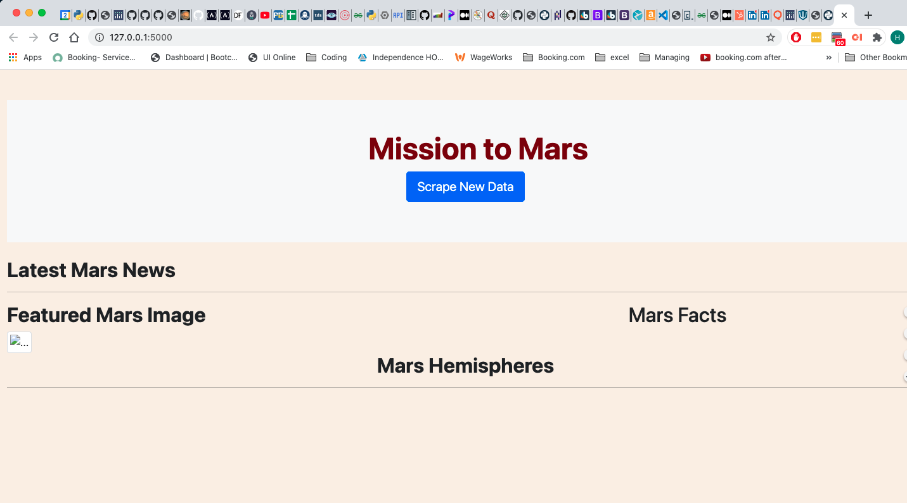
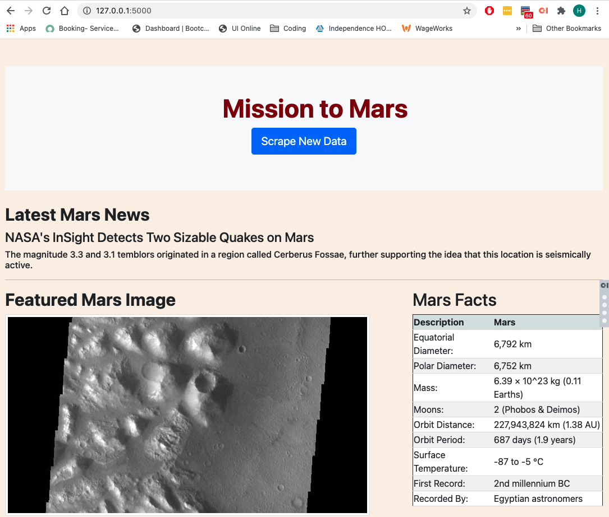
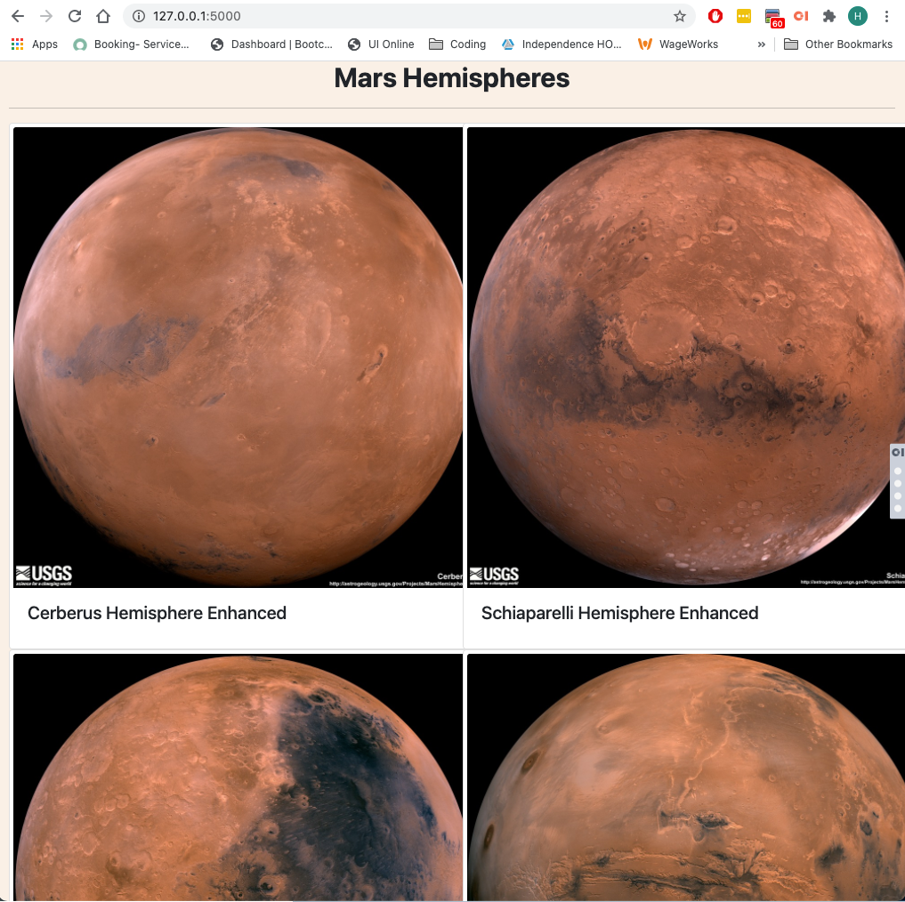
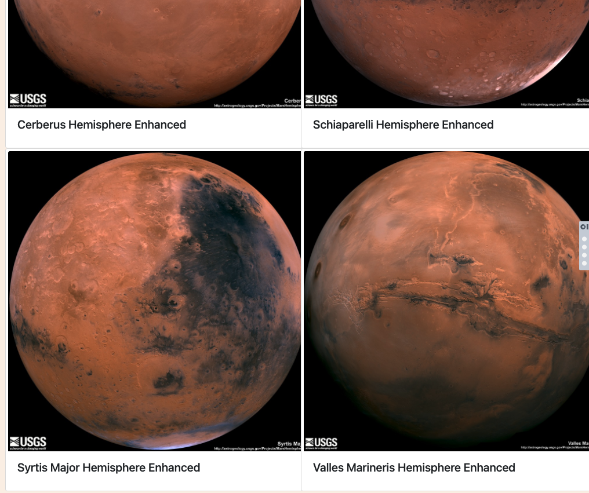

#  Web-scraping-challenge (HW # 12) #

## Summary ##
The objective of this assignment was to build a web application using Flask that scrapes several websites for data related to the Mission to Mars and summarizes the data on an HTML page.  

## Step 1 - Scraping  
My first step was to create a basic Bootstrap HTML page with just the framework of what the end result should look like.
Then I created a Jupyter notebook that I used Pandas, BeautifulSoup and Requests/Splinter to scrape 4 websites for information.  The websites were:
* [NASA Mars News](https://mars.nasa.gov/news/)
* [JPL Mars Space Images](https://data-class-jpl-space.s3.amazonaws.com/JPL_Space/index.html)
* [Mars Facts](https://space-facts.com/mars/)
* [Mars Hemispheres](https://astrogeology.usgs.gov/search/results?q=hemisphere+enhanced&k1=target&v1=Mars)

In these websites I had to scrape **text, images, tables and urls**. Some of the URL's had to be built based on the scraped information.  This part wasn't particulary difficult except for getting the source urls in some pages weren't so easy for me.

## Step 2 - MongoDB & Flask Application  
After creating the Jupyter notebook to code the scrape for each website I needed to convert it to a Python script and create a Flask app that would
1. Render the webpage with a button to run the application for scraping
2. Call the scrape function from another python script for scraping
3. Store all of the scraped data into a dictionary (text, urls, html table script, image urls)
4. Create a MongoDB to store the dictionary data 
5. Return to the root route and load all the data from the MongoDB collection into the webpage
### Screenshot of MongoDB

## Challenges 
My first challenge was getting the right tags to search for in BeautifulSoup.  Initially I easily scraped the latest news headline and summary but when I ran the flask app it returned something else so I had to go back and find a better tag.  This seemed to happen with all 4 websites and I spent some time experimenting how to actually scrape what I needed.

In my Jupyter notebook I used Chrome Webdriver, Requests/Splinter to get data but in the Flask app I chose to just use the webdriver.  I intend to go back and see if I can improve performance as opening the browers and switching URLs seems slow.

The second major challenge was getting the table to display.  When I opened the index.html in a browser it showed but trying to render it with Flask resulted with errors. The URL was bad.  I struggled with this until I used '| safe' within the variable and it worked.

The final major challenge was rendering the four hemispheres.  Initually I coded them each individually calling each by the index in the dictionary/database which worked but not when I cleared out the db in MongoDB.  It returned a jinja2 exception that there was no index 0 in the list.  So I had to go back and use jinja for loop to create the 4 hemispheres.

## Screenshots ##
Base website before scrape

Website after scrape

